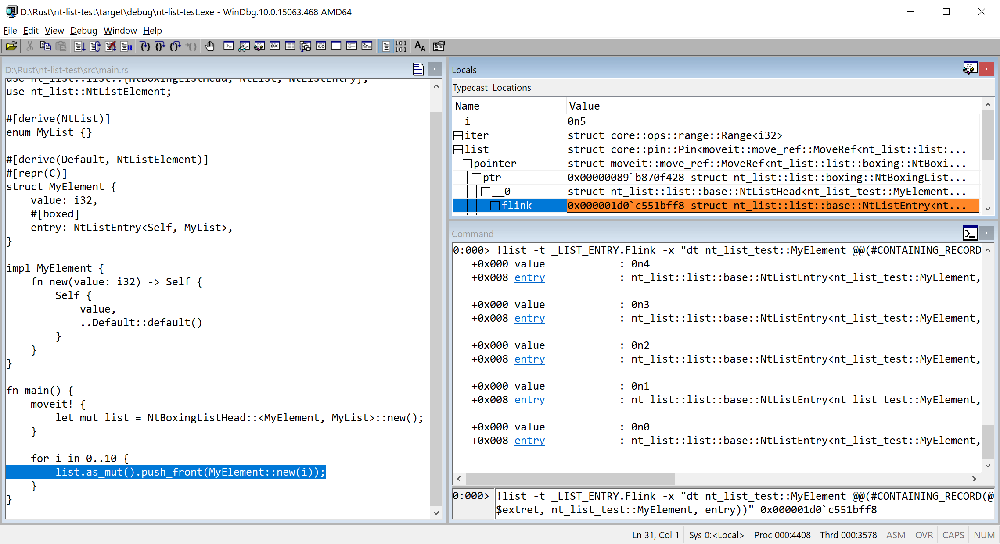

# nt-list

[](https://crates.io/crates/nt-list)
[](https://docs.rs/nt-list)


*by Colin Finck <<colin@reactos.org>>*

Provides compatible, type-safe, and idiomatic Rust implementations of the Windows NT Linked Lists, known as [`LIST_ENTRY`](https://docs.microsoft.com/en-us/windows/win32/api/ntdef/ns-ntdef-list_entry) and [`SINGLE_LIST_ENTRY`](https://docs.microsoft.com/en-us/windows/win32/api/ntdef/ns-ntdef-single_list_entry).

## In Action
  
Debugging a Rust application in WinDbg and using the [`!list`](https://docs.microsoft.com/en-us/windows-hardware/drivers/debugger/-list) extension to traverse a doubly linked list.
A testament to the compatibility between `nt-list` and `LIST_ENTRY`.

## Details
Singly and doubly linked lists of this format are fundamental data structures widely used in Windows itself and in drivers written for Windows.
In the case of a doubly linked list, Windows defines a `LIST_ENTRY` structure with forward and backward pointers to other `LIST_ENTRY` structures.
`LIST_ENTRY` is then embedded into your own element structure.
Check the [relevant Microsoft documentation](https://docs.microsoft.com/en-us/windows-hardware/drivers/kernel/singly-and-doubly-linked-lists) for more details on linked lists in Windows.

This design exhibits several properties that differ from textbook linked list implementations:

* A single element can be part of multiple lists (by having multiple `LIST_ENTRY` fields).
* YOU are responsible for pushing only elements of the same type to a list.
  Without any type safety, the C/C++ compiler cannot prevent you from adding differently typed elements to the same list.
* Links point to the `LIST_ENTRY` field of an element and not to the element itself.
  YOU need to retrieve the corresponding element structure using `CONTAINING_RECORD`, and YOU are responsible for all parameters passed to that macro.

The _nt-list_ crate introduces type safety for these lists, taking away some responsibility from the user and moving it to the compiler.
Additionally, it offers an idiomatic Rust interface similar to that of [`LinkedList`](https://doc.rust-lang.org/std/collections/struct.LinkedList.html) and [`Vec`](https://doc.rust-lang.org/std/vec/struct.Vec.html).

## Example
Creating a linked list with `nt-list` boils down to these three steps:

1. You define an empty enum to identify your list (for type safety when pushing elements), and derive either `NtList` (doubly linked list) or `NtSingleList` (singly linked list).
2. You define your element structure, declare an entry as `#[boxed]` if desired, and derive `NtListElement`.
3. You call `new` of the respective list implementation with the element structure and empty enum as type parameters.

All of this taken together looks like:

```rust,no_run
#[derive(NtSingleList)]
enum MyList {}

#[derive(Default, NtListElement)]
#[repr(C)]
struct MyElement {
    #[boxed]
    entry: NtSingleListEntry<Self, MyList>,
    value: i32,
}

fn test() {
    let mut list = NtBoxingSingleListHead::<MyElement, MyList>::new();

    list.push_back(MyElement {
        value: 42,
        ..Default::default()
    });

    for element in list.iter() {
        println!("{}", element.value);
    }
}
```

Check the [module-level documentation of _list_](https://docs.rs/nt-list/latest/nt-list/list/) for a doubly linked list example.

## `no_std` support
The crate is `no_std`-compatible and therefore usable from firmware-level code up to user-mode applications.

To support heap allocations in `NtBoxingListHead` and `NtBoxingSingleListHead`, the crate depends on the `alloc` library.
If you want to use the crate in a pure `no_std` environment without heap allocations, include it with `default-features = false` to disable the default `alloc` feature.

## License
This crate is licensed under either of

 * [Apache License, Version 2.0](http://www.apache.org/licenses/LICENSE-2.0)
 * [MIT license](http://opensource.org/licenses/MIT)

at your option.

Unless you explicitly state otherwise, any contribution intentionally submitted for inclusion in the work by you, as defined in the Apache-2.0 license, shall be dual licensed as above, without any additional terms or conditions.
